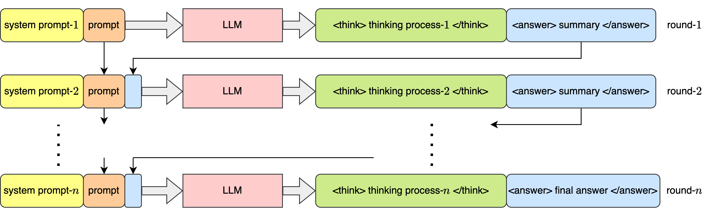

# MOTIF: Modular Thinking via Reinforcement Fine-tuning in LLMs

The [INFTYTHINK architecture](https://arxiv.org/abs/2503.06692v1), shown below, allows multi-round thinking for extended LLM reasoning beyond its context size.

  

In this work, we propose a GRPO based training method for such a system that allows to calculate the accuracy reward by rolling out trajectories and applying the reward at the first round of inference outcomes. This is depicted as following:

  

